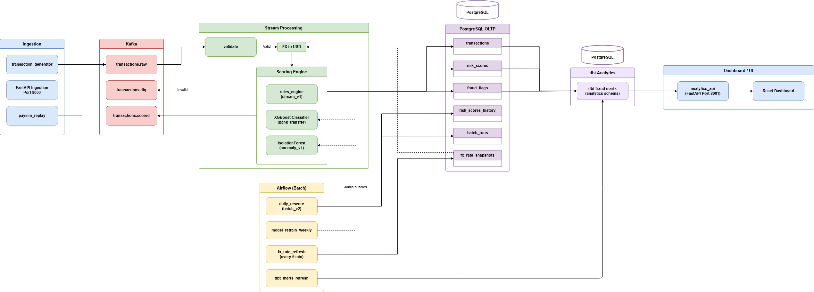

# Real-Time Fraud Detection

PaySim-inspired **synthetic transactions** are ingested through **Kafka**, scored in near real time (**rules + XGBoost + IsolationForest**), stored in **PostgreSQL**, re-scored on a schedule by **Airflow** (stricter batch ruleset), and summarized in a **React dashboard** backed by **dbt** marts and a small **FastAPI** analytics API.

The layout follows a **lambda-style** split: a speed layer (stream consumer), a batch layer (nightly re-score and ML ops), and an analytics layer (dbt → dashboard).

## Architecture



*Editable diagram: [docs/fraud_detection_system.drawio](docs/fraud_detection_system.drawio)*

**End-to-end flow (high level):**

1. **Ingest** — Generator, FastAPI, or PaySim replay → `transactions.raw`
2. **Stream score** — Consumer validates, converts FX to USD, runs rules + ML + anomaly, writes OLTP tables, publishes `transactions.scored` (invalid events → `transactions.dlq`)
3. **Batch** — Airflow refreshes FX, daily re-score into history, weekly model retrain (static data), dbt mart refresh
4. **Serve** — dbt builds `analytics.*` marts → analytics API → React dashboard

| Layer | Component | Role |
| ----- | --------- | ---- |
| Speed | Kafka consumer (`stream_v1`) | Multi-signal tier scoring, OLTP upserts |
| ML | XGBoost + IsolationForest | `bank_transfer` fraud prob + anomaly score |
| Batch | Airflow (`batch_v2`, DAGs) | Stricter re-score, FX, retrain, dbt |
| Analytics | dbt (`fraud_analytics`) | Staging → marts in Postgres `analytics` schema |
| UI | React + FastAPI | Read-only KPIs and trends over marts |

Deeper component and table-level detail: **[docs/architecture.md](docs/architecture.md)**.

## Roadmap

The repo today targets a **local Docker demo** (single Postgres for OLTP + analytics). Planned work — **warehouse/OLAP** (Snowflake, ClickHouse, Databricks), **cloud deployment**, downstream consumers on `transactions.scored`, DLQ replay, production label loops, observability, feature store, and case management — is outlined in **[docs/roadmap.md](docs/roadmap.md)**.

## Quick start

```powershell
copy .env.example .env
py -3.12 -m venv .venv
.\.venv\Scripts\Activate.ps1
pip install -r requirements.txt
docker compose up -d --build
powershell -ExecutionPolicy Bypass -File scripts/wait-for.ps1
python scripts/train_anomaly.py
python -m consumer.main          # terminal 1
python -m producer.generator     # terminal 2
```

Install, service URLs, env vars, troubleshooting: **[docs/setup.md](docs/setup.md)** · Demo walkthrough: **[docs/demo.md](docs/demo.md)** · All docs: **[docs/index.md](docs/index.md)**

## Documentation

| I want to… | Read |
| ---------- | ---- |
| Run the stack locally | [docs/setup.md](docs/setup.md) |
| Walk through a demo | [docs/demo.md](docs/demo.md) |
| Browse every doc | [docs/index.md](docs/index.md) |
| Scoring tiers and rules | [docs/scoring.md](docs/scoring.md) |
| dbt marts and dashboard KPIs | [docs/analytics.md](docs/analytics.md) |
| Model retrain (Airflow) | [docs/ml_retrain.md](docs/ml_retrain.md) |
| React dashboard | [frontend/README.md](frontend/README.md) |

Airflow UI: **[http://localhost:8081](http://localhost:8081)** (`admin` / `admin`) — enable DAGs after `docker compose up`; DAG reference in [docs/index.md § Airflow](docs/index.md#airflow-batch--mlops).

## Scoring (summary)

Hard decline → auto-decline (ML high / rules ≥ 85) → review (2+ soft signals) → approve. Full tier semantics: **[docs/scoring.md](docs/scoring.md)**.

## Model retrain (summary)

Weekly **`model_retrain_weekly`** retrains on **static PaySim/synthetic data** (not live DB labels) and promotes bundles only when metrics improve. Details: **[docs/ml_retrain.md](docs/ml_retrain.md)**.

## Project structure

```
producer/          # Generator, FastAPI, PaySim replay
consumer/          # Stream scoring: validate → FX → rules + ML + anomaly
airflow/dags/      # daily_rescore, model_retrain_weekly, fx_rate_refresh, dbt_marts_refresh
analytics_api/     # FastAPI JSON over dbt marts
frontend/          # React analytics dashboard
dbt_fraud/         # Analytics marts
infra/postgres/    # Schema migrations
analysis/          # PaySim training helpers
models/            # Classifier + anomaly bundles
docs/              # Detailed docs — index at docs/index.md
```

## Testing

```powershell
pytest tests/unit -v
ruff check .
```

## Delivery semantics

At-least-once Kafka delivery with idempotent `INSERT ... ON CONFLICT` upserts on `transaction_id`.
