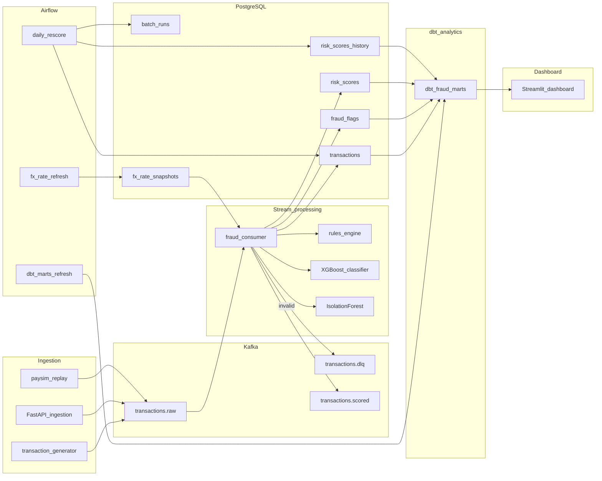

# Real-Time Fraud Detection

A real-time fraud detection pipeline: synthetic transactions (PaySim-inspired) flow through **Kafka**, get scored by a stream consumer (**rules + XGBoost + IsolationForest**), persist to **PostgreSQL**, are re-scored nightly by **Airflow** with a stricter batch ruleset, and feed a **Streamlit** dashboard via **dbt** analytics marts.



## Lambda layers

| Layer | Component | Version | Purpose |
| ----- | --------- | ------- | ------- |
| Speed | Kafka consumer | `stream_v1` | Multi-signal tier scoring |
| ML | XGBoost | bundled | Fraud probability for `bank_transfer` |
| Anomaly | IsolationForest | `anomaly_v1` | Unsupervised outlier score |
| Batch | Airflow | `batch_v2` | Stricter re-score → history |
| FX | Airflow | — | FX snapshots every 5 min |
| Analytics | dbt | `fraud_analytics` | Staging → marts in `analytics` schema |

## Quick start

```powershell
copy .env.example .env
py -3.12 -m venv .venv
.\.venv\Scripts\Activate.ps1
pip install -r requirements.txt
docker compose up -d --build
powershell -ExecutionPolicy Bypass -File scripts/wait-for.ps1
python scripts/train_anomaly.py
python -m consumer.main          # terminal 1
python -m producer.generator     # terminal 2
```

Full setup, service URLs, and env vars: **[docs/setup.md](docs/setup.md)**

## Documentation

| Topic | Doc |
| ----- | --- |
| Setup & commands | [docs/setup.md](docs/setup.md) |
| Scoring & tiers | [docs/scoring.md](docs/scoring.md) |
| dbt & dashboard KPIs | [docs/analytics.md](docs/analytics.md) |
| Python dependencies | [docs/dependencies.md](docs/dependencies.md) |
| Demo walkthrough | [docs/demo.md](docs/demo.md) |
| Architecture | [docs/architecture.md](docs/architecture.md) |

## Scoring (summary)

Multi-signal cascade: hard decline → auto-decline (ML high / rules ≥ 85) → review (2+ soft signals) → approve. See **[docs/scoring.md](docs/scoring.md)** for thresholds, flag reasons, and examples.

## Project structure

```
producer/          # Generator, FastAPI, PaySim replay
consumer/          # Stream scoring: validate → FX → rules + ML + anomaly
airflow/dags/      # daily_rescore, fx_rate_refresh, dbt_marts_refresh
dashboard/         # Streamlit KPIs
dbt_fraud/         # Analytics marts
infra/postgres/    # Schema migrations
analysis/          # PaySim training helpers, profiling
models/            # Classifier + anomaly bundles
scripts/           # Train models, seed users, wait-for
shared/            # Schema, FX, synthetic data
tests/             # Unit tests
docs/              # Detailed documentation
```

## Testing

```powershell
pytest tests/unit -v
ruff check .
```

## Delivery semantics

At-least-once Kafka delivery with idempotent `INSERT ... ON CONFLICT` upserts on `transaction_id`.

## License

MIT
