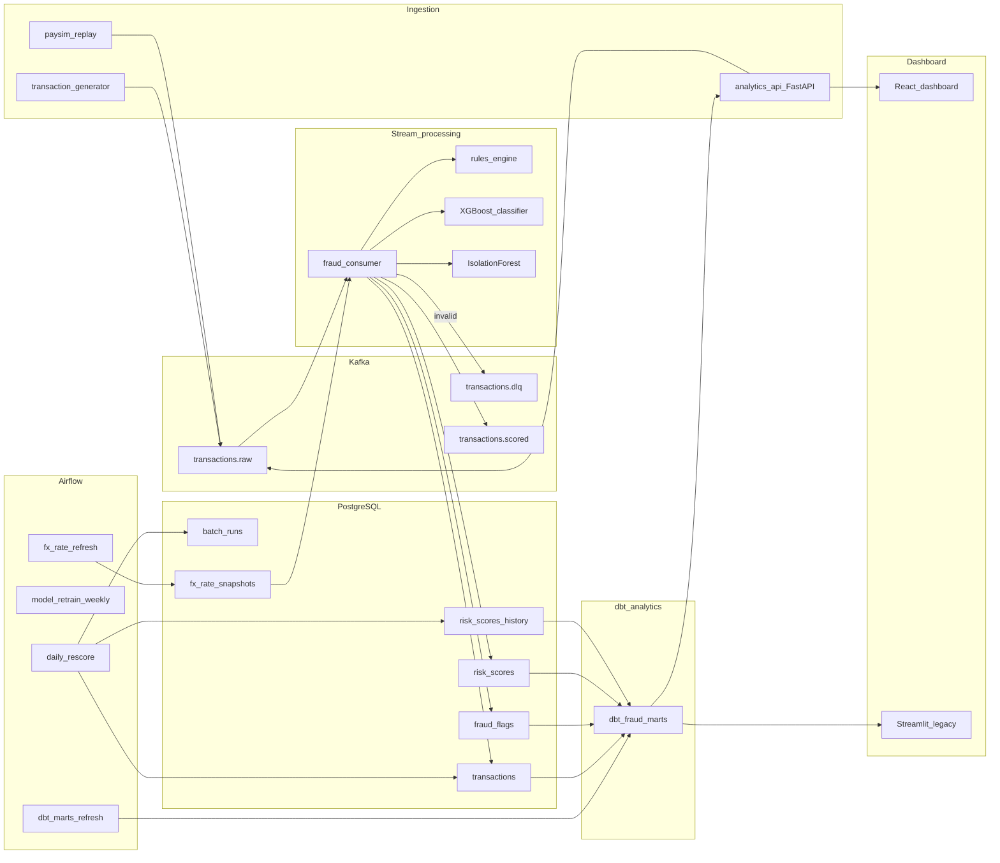

# Real-Time Fraud Detection

A real-time fraud detection pipeline: synthetic transactions (PaySim-inspired) flow through **Kafka**, get scored by a stream consumer (**rules + XGBoost + IsolationForest**), persist to **PostgreSQL**, are re-scored nightly by **Airflow** with a stricter batch ruleset, and feed a **React analytics dashboard** (FastAPI + dbt marts). A legacy **Streamlit** dashboard is also available.




## Lambda layers


| Layer     | Component       | Version           | Purpose                                                     |
| --------- | --------------- | ----------------- | ----------------------------------------------------------- |
| Speed     | Kafka consumer  | `stream_v1`       | Multi-signal tier scoring                                   |
| ML        | XGBoost         | bundled           | Fraud probability for `bank_transfer`                       |
| Anomaly   | IsolationForest | `anomaly_v1`      | Unsupervised outlier score                                  |
| Batch     | Airflow         | `batch_v2`        | Stricter re-score → history                                 |
| ML ops    | Airflow         | weekly            | Safe redeploy: retrain static data → promote only if better |
| FX        | Airflow         | —                 | FX snapshots every 5 min                                    |
| Analytics | dbt             | `fraud_analytics` | Staging → marts in `analytics` schema                       |


## Quick start

```powershell
copy .env.example .env
py -3.12 -m venv .venv
.\.venv\Scripts\Activate.ps1
pip install -r requirements.txt
docker compose up -d --build
powershell -ExecutionPolicy Bypass -File scripts/wait-for.ps1
python scripts/train_anomaly.py
python -m consumer.main          # terminal 1
python -m producer.generator     # terminal 2
```

Full install, **service URLs**, env vars, and troubleshooting: **[docs/setup.md](docs/setup.md)**  
Step-by-step demo: **[docs/demo.md](docs/demo.md)**  
Full doc index: **[docs/README.md](docs/README.md)**

## Documentation

### Start here


| I want to…                      | Read                                         |
| ------------------------------- | -------------------------------------------- |
| Install and run the stack       | [docs/setup.md](docs/setup.md)               |
| Walk through a demo             | [docs/demo.md](docs/demo.md)                 |
| See how components fit together | [docs/architecture.md](docs/architecture.md) |
| Browse all docs                 | [docs/README.md](docs/README.md)             |


### React dashboard (frontend)

The primary UI is a **React + Vite** app under [`frontend/`](frontend/). Full setup, demo mode, and GitHub Pages: **[frontend/README.md](frontend/README.md)**.


| I want to… | Read |
| ---------- | ---- |
| Run the React app locally (live API) | [frontend/README.md — Local development](frontend/README.md#local-development) |
| Try the dashboard without Postgres/API (mock data) | [frontend/README.md — Demo mode](frontend/README.md#demo-mode-mock-data-no-backend) |
| Publish a portfolio demo on GitHub Pages | [frontend/README.md — GitHub Pages](frontend/README.md#github-pages) |
| Understand KPIs and marts the UI reads | [docs/analytics.md](docs/analytics.md) |
| Service URLs (5173 dev, 3000 Docker) | [docs/setup.md — Service URLs](docs/setup.md#service-urls) |
| End-to-end demo including the dashboard | [docs/demo.md — Step 5](docs/demo.md#step-5--dashboard--batch) |


### Airflow

Open the UI at **[http://localhost:8081](http://localhost:8081)** (`admin` / `admin`). Enable DAGs in the UI after `docker compose up` — see [docs/demo.md](docs/demo.md).


| I want to…                                        | Read                                                                                |
| ------------------------------------------------- | ----------------------------------------------------------------------------------- |
| Fix UI, logs, or task failures                    | [docs/setup.md — Airflow troubleshooting](docs/setup.md#airflow-troubleshooting)    |
| Understand each DAG and schedule                  | [docs/README.md — Airflow](docs/README.md#airflow-batch--mlops)                     |
| Refresh dashboard marts (`dbt_marts_refresh`)     | [docs/analytics.md — Airflow refresh](docs/analytics.md#airflow-refresh)            |
| Batch re-score vs stream (`daily_rescore`)        | [docs/scoring.md — stream vs batch](docs/scoring.md#rulesets-stream_v1-vs-batch_v2) |
| Retrain & promote models (`model_retrain_weekly`) | [docs/ml_retrain.md](docs/ml_retrain.md)                                            |
| FX rates for the consumer (`fx_rate_refresh`)     | [docs/setup.md — Multi-currency](docs/setup.md#multi-currency)                      |


DAG code lives in `[airflow/dags/](airflow/dags/)`. Rebuild the image after changing `[airflow/requirements.txt](airflow/requirements.txt)`.

### Stream scoring, analytics & reference


| I want to…                              | Read                                             |
| --------------------------------------- | ------------------------------------------------ |
| Tiers, rules, ML, anomaly, flag reasons | [docs/scoring.md](docs/scoring.md)               |
| dbt marts and dashboard KPIs            | [docs/analytics.md](docs/analytics.md)           |
| Python / Docker dependency map          | [docs/dependencies.md](docs/dependencies.md)     |
| Requirements checklist                  | [docs/REQUIREMENTS.md](docs/REQUIREMENTS.md)     |
| Kafka event schema                      | [docs/event_schema.json](docs/event_schema.json) |


## Scoring (summary)

Multi-signal cascade: hard decline → auto-decline (ML high / rules ≥ 85) → review (2+ soft signals) → approve. Details: **[docs/scoring.md](docs/scoring.md)**.

## Model retrain (summary)

Weekly `**model_retrain_weekly`** is **safe deployment** on static PaySim/synthetic data (not live DB learning). Full flow, promote rules, and XGBoost alignment: **[docs/ml_retrain.md](docs/ml_retrain.md)**.

## Project structure

```
producer/          # Generator, FastAPI, PaySim replay
consumer/          # Stream scoring: validate → FX → rules + ML + anomaly
airflow/dags/      # daily_rescore, model_retrain_weekly, fx_rate_refresh, dbt_marts_refresh
dashboard/         # Streamlit KPIs (legacy)
analytics_api/     # FastAPI JSON over dbt marts
frontend/          # React analytics dashboard — see frontend/README.md
dbt_fraud/         # Analytics marts
infra/postgres/    # Schema migrations
analysis/          # PaySim training helpers, profiling
models/            # Classifier + anomaly bundles
scripts/           # Train models, seed users, wait-for
shared/            # Schema, FX, synthetic data
tests/             # Unit tests
docs/              # Detailed documentation — start at docs/README.md
```

See also: **[frontend/README.md](frontend/README.md)** (React dashboard) · **[docs/README.md](docs/README.md)** (full doc index)

## Testing

```powershell
pytest tests/unit -v
ruff check .
```

## Delivery semantics

At-least-once Kafka delivery with idempotent `INSERT ... ON CONFLICT` upserts on `transaction_id`.

