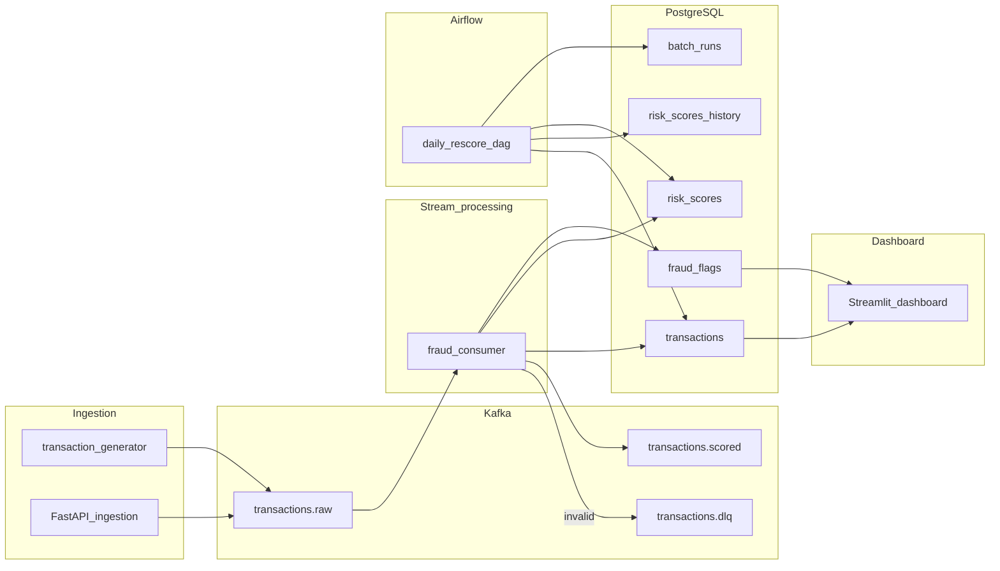

# Real-Time Fraud Detection

A portfolio-grade real-time fraud detection pipeline: synthetic transactions flow through **Kafka**, get scored by a stream consumer (rules + anomaly detection), persist to **PostgreSQL**, and are re-scored nightly by **Airflow** with a stricter batch ruleset.



## Lambda Story

| Layer | Component | Version tag | Purpose |
|-------|-----------|-------------|---------|
| Speed | Kafka consumer | `stream_v1` | Low-latency scoring |
| Batch | Airflow DAG | `batch_v2` | Stricter re-score into history table |

## Prerequisites

- Docker Desktop (8 GB+ RAM recommended)
- Python 3.11+
- Make (optional; PowerShell commands provided below)

## Quick Start

```powershell
# 1. Copy env, create venv, and install Python deps
copy .env.example .env
py -3.12 -m venv .venv
.\.venv\Scripts\Activate.ps1
python -m pip install --upgrade pip
pip install -r requirements.txt

# 2. Start infrastructure
docker compose up -d
powershell -ExecutionPolicy Bypass -File scripts/wait-for.ps1

# 3. Train anomaly model (optional but recommended)
python scripts/train_anomaly.py

# 4. Start consumer (terminal 1)
python -m consumer.main

# 5. Start generator (terminal 2)
python -m producer.generator
```

### Service URLs

| Service | URL | Credentials |
|---------|-----|-------------|
| Kafka UI | http://localhost:8080 | — |
| Airflow | http://localhost:8081 | admin / admin |
| FastAPI | http://localhost:8000/docs | — |
| Streamlit | http://localhost:8501 | — |

## Demo Script (5 steps)

### Step 1 — Bring up infrastructure

```powershell
docker compose up -d
powershell -ExecutionPolicy Bypass -File scripts/wait-for.ps1
```

### Step 2 — Start generator + consumer

```powershell
# Terminal 1
python -m consumer.main

# Terminal 2
python -m producer.generator
```

Watch Kafka UI at http://localhost:8080 — messages on `transactions.raw` and `transactions.scored`.

### Step 3 — POST a fraudulent payload

```powershell
# Start API if not running
uvicorn producer.api.main:app --port 8000

# Geo mismatch fraud
curl -X POST http://localhost:8000/transactions `
  -H "Content-Type: application/json" `
  -d '{"transaction_id":"11111111-1111-1111-1111-111111111111","user_id":"demo_user","timestamp":"2026-05-21T12:00:00Z","amount":999.99,"currency":"USD","merchant_id":"m_fraud","merchant_category":"7995","country":"US","payment_method":"card","ip_country":"RU"}'
```

### Step 4 — Query Postgres for flag_reasons

```powershell
docker exec -it real-time-fraud-detection-postgres-1 psql -U fraud -d fraud_db -c `
  "SELECT transaction_id, is_fraud, flag_reasons, final_score FROM fraud_flags ff JOIN risk_scores rs ON rs.transaction_id = ff.transaction_id WHERE ff.is_fraud ORDER BY ff.scored_at DESC LIMIT 5;"
```

### Step 5 — Trigger Airflow batch re-score

1. Open http://localhost:8081 (admin/admin)
2. Enable and trigger the `daily_rescore` DAG
3. Compare stream vs batch:

```sql
SELECT rs.final_score AS stream_score, rsh.final_score AS batch_score
FROM risk_scores rs
JOIN risk_scores_history rsh ON rsh.transaction_id = rs.transaction_id
LIMIT 10;
```

## Makefile Targets

| Target | Description |
|--------|-------------|
| `make up` | Start Docker services + wait |
| `make down` | Tear down volumes |
| `make consumer` | Run stream consumer |
| `make generator` | Run synthetic producer |
| `make api` | Run FastAPI ingestion |
| `make dashboard` | Run Streamlit dashboard |
| `make test` | Run unit tests |
| `make train-model` | Train IsolationForest |
| `make profile` | Generate data profile markdown |

## Scoring Rules

| Rule | Trigger | Weight |
|------|---------|--------|
| HIGH_AMOUNT | amount > user P99 (or global P99) | 40 |
| VELOCITY_1H | > 5 tx/user/hour (3 in batch) | 35 |
| GEO_MISMATCH | country ≠ ip_country | 50 (hard decline) |
| NEW_MERCHANT_HIGH | first merchant + amount > P95 | 30 |

**Final score:** `0.6 × rule_score + 0.4 × anomaly_score` — flagged when ≥ 70 or hard-decline rule fires.

## Delivery Semantics

At-least-once Kafka delivery with idempotent `INSERT ... ON CONFLICT` upserts on `transaction_id`.

## Kafka Client

Uses **confluent-kafka** (production-aligned). Single-broker Compose with Zookeeper for cross-platform simplicity; KRaft migration noted as future ops improvement.

## Project Structure

```
producer/     # Generator + FastAPI ingestion
consumer/     # Stream scoring pipeline
airflow/      # Batch re-score DAG
dashboard/    # Streamlit KPIs
infra/        # Postgres schema + migrations
analysis/     # Data profiling script
scripts/      # Train model, seed users, wait-for
tests/        # Unit tests
docs/         # Requirements, schema, architecture
```

## Testing

```powershell
pytest tests/unit -v
ruff check .
```

CI runs lint + unit tests on push (`.github/workflows/ci.yml`).

## Tier 3 — Future Work (not implemented)

- **Kafka:** Migrate to Confluent Cloud with Schema Registry
- **Warehouse:** Export Postgres analytics to Snowflake
- **Stream processing:** Secondary consumer in Spark Structured Streaming
- **Ops:** KRaft mode, exactly-once semantics, auth, multi-region

## License

MIT
